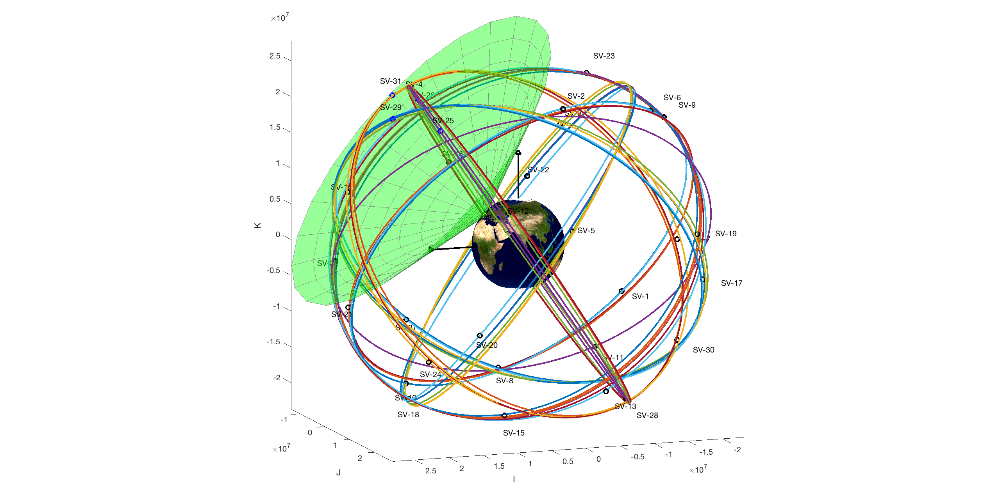
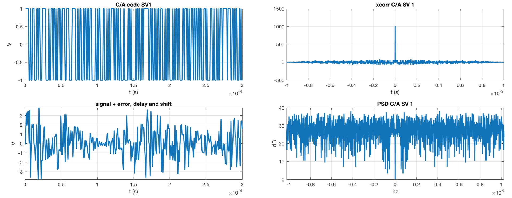
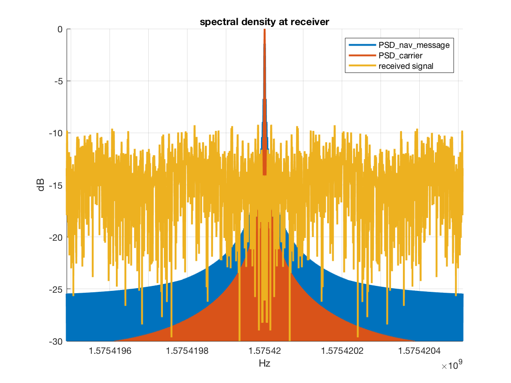
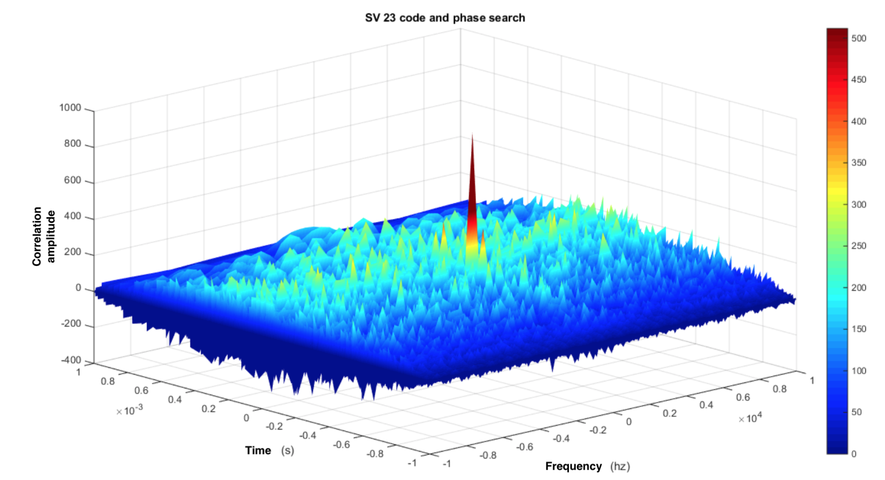
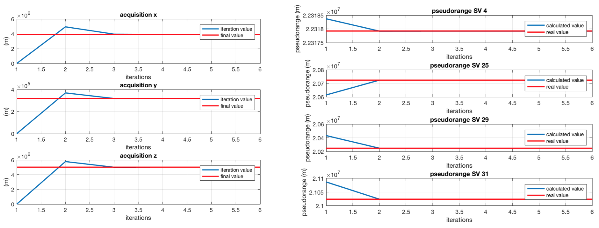
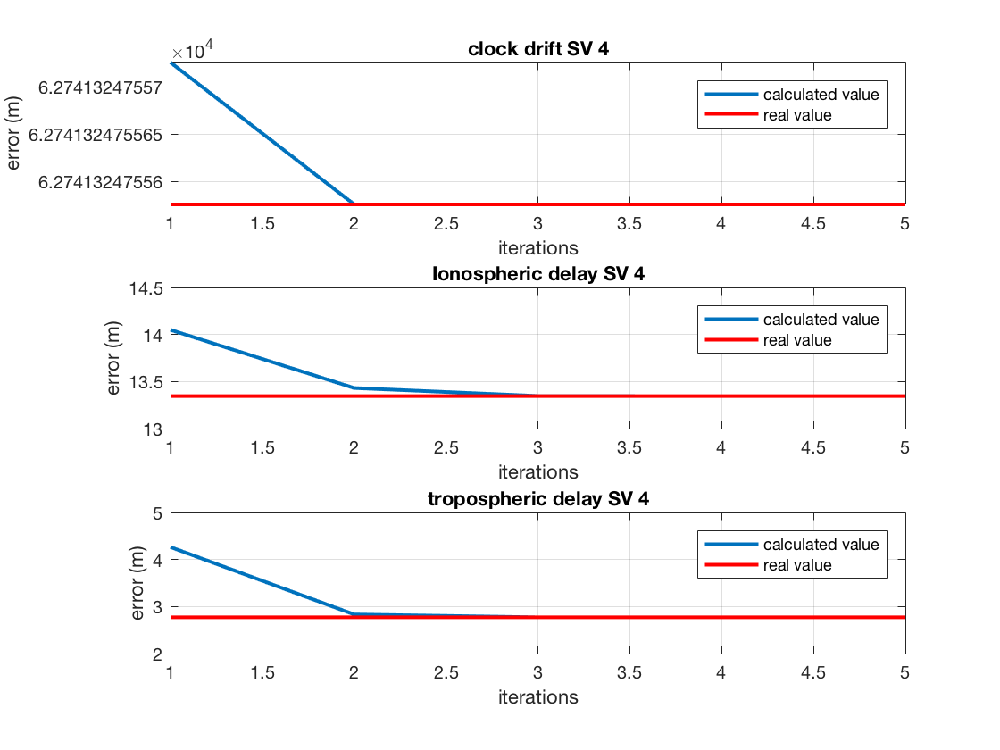
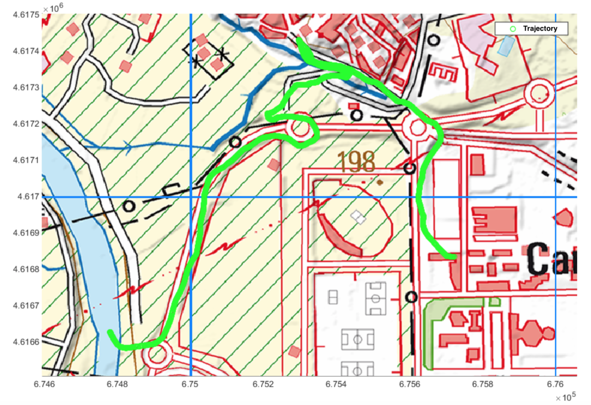

# gps-stack-sim

Toolkit which allows for the simulation of GPS C/A code transmission and receiver acquisition and position calculation. 

A full listing of provided functions can be found [here](#provided-functions). We include scripts which demonstrate following high level functionality: 

* [SV position calculation](calculating-sv-position-and-visible-sv)
* [Signal transmission, error/delay compensation and lock on](signal-transmission-from-sv,-receiver-delay-compensation-and-lock-on)
* [Plotting a trajectory on a map](plotting-a-trajectory-on-a-map)

The [plots_demo.m](https://github.com/JavierAntoran/gps-stack-sim/blob/master/plots_demo.m) script generates most of the plots included in this README file.

A set of Ephemeris and Almanac files are included in the [files](https://github.com/JavierAntoran/gps-stack-sim/tree/master/files) directory. An explanation of the information included in these files and how to download updated versions is also included.

**Before running, add the /lib folder and sub-folders to the MATLAB path. Also add the /files folder if you want to use the provided Ephemeris files and Almanacs.**

## Calculating SV position and visible SV

[sv/sv.m](https://github.com/JavierAntoran/gps-stack-sim/blob/master/sv/sv.m) reads an Ephemeris file and calculates the position of all Space Vehicles (SVs). It then calculates which ones are visible from a certain point on earth with a certain visibility angle. We provide an [image](https://github.com/JavierAntoran/gps-stack-sim/blob/master/sv/land_ocean_ice_2048.png) of the earth's surface which is superimposed on a ellipsoidal model of earth. A valid ephemeris file is required. A vision elevation angle of 30 degrees is assumed in the following image.

In this example, our receiver is located in Zaragoza, Spain.

## Signal transmission from SV, receiver error/delay compensation and lock on

Given valid user position (ECEF), almanac and ephemeris files, the [stack_simulation.m](*?) script simulates the C/A code transmission, the channel, the acquisition procedure (warm start) and the receiver's position calculation. This is done using the visible SV from the receiver's position assuming a vision angle of 30 degrees.

C/A codes are transmitted using BPSK at 1575.42 MHz. All operations are done at base band as simulating signals on the L2 band is very resource intensive.

### Transmitted signal

We generate the Gold codes for every SV and multiply it with a 50 Hz navigation message. The signal is then modulated using BPSK. The resulting

### Channel modeling
We consider tropospheric delay, ionospheric delay, clock error and delay introduced by relativistic effects.

### Acquisition and position recovery

The receiver starts of by searching for SV. This is done through a C/A code search in time and phase. The latter is necessary due to Doppler shift.

Once SV have been found, clock correction is applied to compensate for relativistic effects and receiver position is recovered using least squares. Since tropospheric and ionospheric delays depend on receiver position, this operation is done iteratively. Dilution of precision (DOP) values are calculated.

The following plot shows the convergence of receiver position and pseudoranges from the receiver to each SV.

The following plot shows the convergence of the calculated value for each of the sources of error we model.

## Plotting a trajectory on a map

The script [CSVmap.m](https://github.com/JavierAntoran/gps-stack-sim/blob/master/maps/CSVmap.m) plots a trajectory, given as ECEF (x, y, z) coordinates, on a map in ETRS89 UTM coordinates. The following files are required but not provided: A .csv file with the trajectory, a map file in any format and a corresponding .tfw file.

## Provided functions

### GEO

[ enu ] = ecef2enu( xyz, tmat ) % Convert Earth-centered Earth-Fixed to Local east, north, up (ENU)

[ azel ] = enu2azel( enu ) % Convert Eeast-North-Up to Azimuth + Elevation

[x, y, z] = lla2xyz( fi, lambda, h, a, e2 ) % Convert geodetic latitude, longitude, altitude (LLA) coordinates to XYZ

[ lat, lon, alt ] = xyz2lla( x, y, z, a, e2 ) % Vonvert earth-centered earth-fixed (ECEF) cartesian coordinates to latitude, longitude, and altitude

[ t ] = ltcmat( llh ) % Compute the intermediate matrix for LLH to ECEF

[ dist ] = ECEFrange( SVx, SVy, SVz, gx, gy, gz ) % Calculates distance between observer and SV

### RINEX

[EPH ,header] = read_rinex_nav( filename, sv_IDs) % Reads an ephemerides file and get the information of the requested space vehicles.

[ gps_week, gps_seconds ] = cal2gpstime(varargin) % Calculates GPS seconds from UTC

[ dt ] = gpst2utc( week_number, reference_time, leap_seconds ) % Calculates UTC from GPS seconds

[sat_xyz, orbit_parameters] = eph2ecef(eph ,tsv) % Compute sv orbits and sv position in ECEF for the specified time (tsv) from ephemerides

### TC Lib

[sCA] = CA_gen(pulseLength, SV_vec) % Generates C/A codes for all SVs

[ modulator ] = generate_doppler( f_vec, L ) % generates a matrix to shift CA codes in frequency

[delay_CA, cicles, prop_delay, sat_clock_offset, sat_clock_rel, iono_T, trop_T_equiv] = gps_channel(head, eph, time, Rpos, sCA, L) % Get TX channel including tropo, iono, clock error and relativistic clock

### OTHERS

[ vis_sv ] = visible_sv( satp, rcv_lla, e_mask ) % Search for visible SV given an observation position and elevation

[ f ] = plot_orbits( sat_xyz, orbit_parameters, earth_surface_image, varargin) % Plots SV orbits around the globe

## Resources 

* Some of our functions use code from the **GPS Navigation Toolbox** by Moein Mehrtash https://es.mathworks.com/matlabcentral/fileexchange/41364-gps-navigation-toolbox?focused=3785211&tab=function
* We use the **Convert Cartesian (ECEF) Coordinates to to lat, lon, alt** script by Michael Kleder https://es.mathworks.com/matlabcentral/fileexchange/7941-convert-cartesian-ecef-coordinates-to-lat-lon-alt 
* Compilation of GPS toolboxes: https://www.ngs.noaa.gov/gps-toolbox/

----------------------------------------------

* GPS Almanacs can be obtained from: https://www.navcen.uscg.gov/?pageName=gpsAlmanacs 
* GPS Ephemeris data can be downloaded from: https://cddis.nasa.gov/Data_and_Derived_Products/GNSS/broadcast_ephemeris_data.html#GPShourly 

----------------------------------------------
* Many functions were based on this book: Global Positioning System: Theory and Applications, edited by B.Parkinson,J.Spilker
* Very useful slides on GPS by MIT ocw: https://ocw.mit.edu/courses/earth-atmospheric-and-planetary-sciences/12-540-principles-of-the-global-positioning-system-spring-2012/lecture-notes/MIT12_540S12_lec7.pdf
* More information on coordinate systems: http://www.dirsig.org/docs/new/coordinates.html

----------------------------------------------

* Ionospheric model we use: KLOBUCHAR, Ionospheric Time-Delay Algorithm for Single-Frequency GPS Users (1987), https://ieeexplore.ieee.org/document/4104345?section=abstract 
* Tropospheric model: H. S. Hopfield Two-quartic tropospheric refractivity profile for correcting satellite data (1969) https://agupubs.onlinelibrary.wiley.com/doi/abs/10.1029/JC074i018p04487
* Iterative LS for solving 4d positioning equation: Yuheng He, Approximate Iterative Least Squares Algorithms for GPS Positioning (2010) https://www.computer.org/csdl/proceedings/isspit/2010/9992/00/05711784.pdf  
----------------------------------------------

* It turns out that if you code something similar to this project in C you can spoof real GPS receivers 😁: https://github.com/osqzss/gps-sdr-sim

